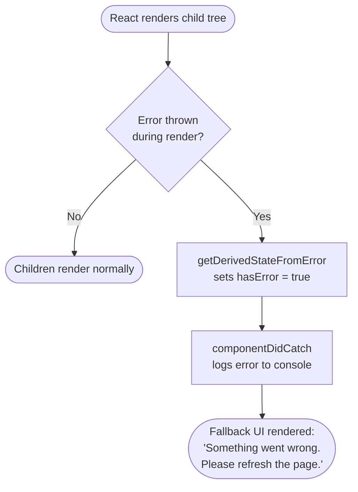
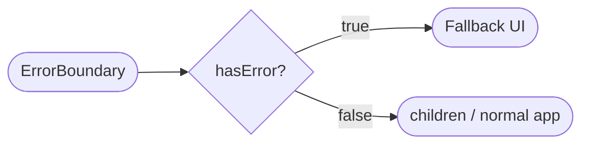
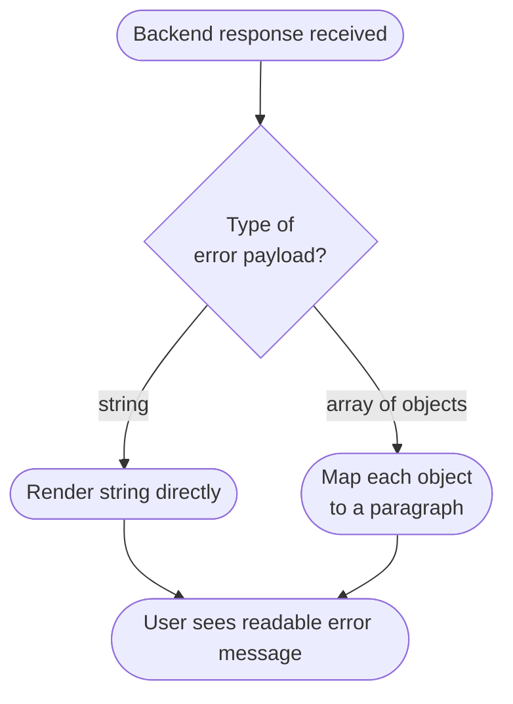
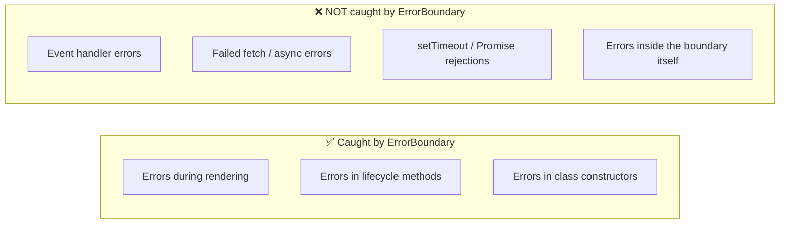
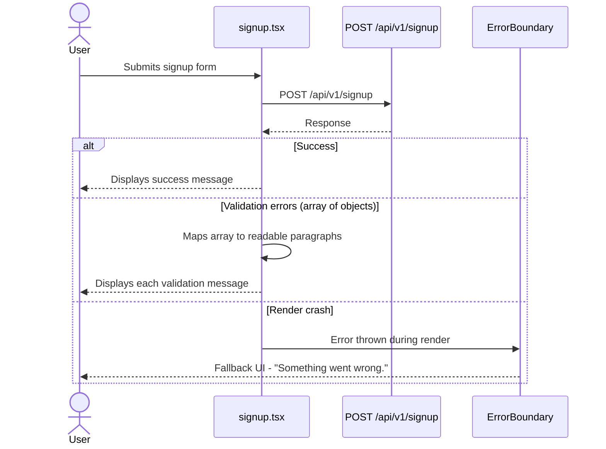
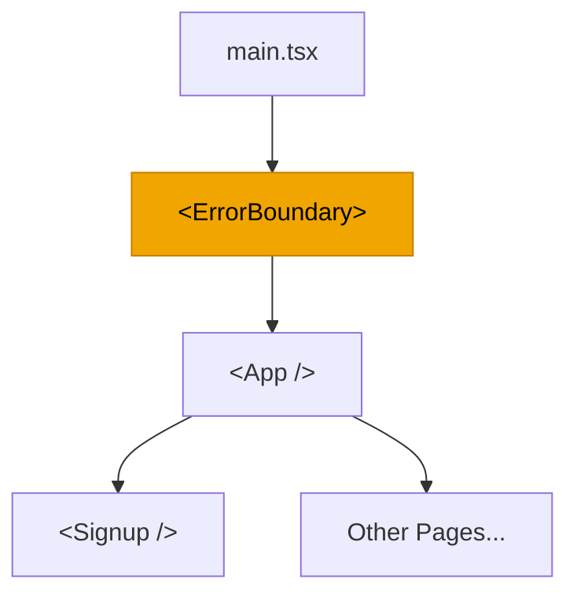

# Error Boundary

A reusable React error boundary that catches rendering errors across the application and displays a graceful fallback UI instead of a blank/broken screen.

---

## What Changed

| File | Change |
|---|---|
| `src/component/ErrorBoundary.tsx` | Added the reusable error boundary component |
| `src/main.tsx` | Wrapped `<App />` with `<ErrorBoundary>` |
| `src/pages/signup.tsx` | Converts backend validation errors into readable text before rendering |

---

## How It Works

`ErrorBoundary` is a React **class component** that uses two lifecycle methods to intercept rendering errors in its subtree.



### Lifecycle Methods

| Method | Triggered when | What it does |
|---|---|---|
| `getDerivedStateFromError()` | A child throws during rendering | Sets `hasError = true` in state |
| `componentDidCatch()` | After the error is captured | Logs the error + info to the console |

### Render Logic



### Usage

```tsx
<ErrorBoundary>
  <App />
</ErrorBoundary>
```

---

## Signup Error Handling

The signup backend can return validation errors as an **array of objects**. React cannot render objects directly as children, so `signup.tsx` inspects the response and normalises it before rendering.



Without this normalisation the browser console would show:

```
Objects are not valid as a React child
```

---

## What the Error Boundary Does — and Does NOT — Catch



> **Tip:** For cases outside the boundary, use `try/catch`, check response status codes, and manage error state manually.

---

## Signup Request Flow

The full lifecycle from form submit to UI update:



---

## Component Tree Overview



The `<ErrorBoundary>` sits at the root so any unhandled render error anywhere in the tree is caught — not just inside `<Signup />`.


\## What Changed


The application now uses an error boundary around the main React app.


Changed files:


\- `src/component/ErrorBoundary.tsx`: Added the reusable error boundary component.

\- `src/main.tsx`: Wrapped `<App />` with `<ErrorBoundary>`.

\- `src/pages/signup.tsx`: Converted backend validation errors into readable text before rendering.


\## How It Works


`ErrorBoundary` is a React class component. It uses two lifecycle methods:


\- `getDerivedStateFromError()` sets `hasError` to `true` when a child component throws during rendering.

\- `componentDidCatch()` logs the error and additional error information to the browser console.


When `hasError` is `true`, the boundary renders this fallback UI instead of allowing the entire React tree to disappear:


```text

Something went wrong.

Please refresh the page and try again.

```


When there is no error, the boundary renders its `children`, which is the normal application:


```tsx

<ErrorBoundary>

&#x20; <App />

</ErrorBoundary>

```


\## Signup Error Handling


The signup backend can return validation errors as an array of objects. React cannot render an object directly as a child, so `signup.tsx` now checks the response:


\- A string message is rendered directly.

\- An array of validation errors is mapped into separate paragraphs.


This prevents errors such as:


```text

Objects are not valid as a React child

```


\## Important Limitation


An error boundary catches errors during rendering, lifecycle methods, and constructors of child components. It does not automatically catch:


\- Errors inside event handlers

\- Failed `fetch()` requests

\- Errors thrown in asynchronous code

\- Errors in the error boundary itself


Those cases should be handled with `try/catch`, response status checks, and user-friendly error state.


\## Current Signup Request Flow


1\. The user submits the signup form.

2\. The frontend sends `POST /api/v1/signup`.

3\. The backend validates the username and password.

4\. A successful response displays the success message.

5\. A validation response displays each validation message as text.

6\. A render failure is caught by `ErrorBoundary` and replaced with fallback UI.


